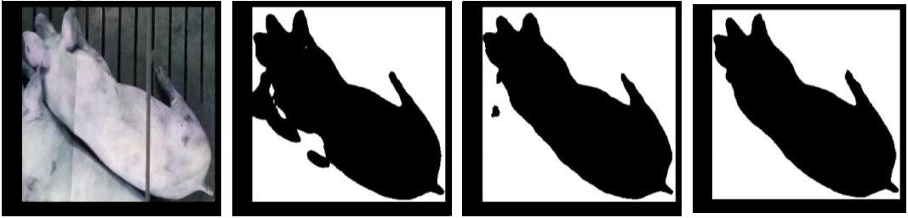

## Tl;dr

Решение задачи сегментации, трекинга и оценки активности поросят командой **svinkotrack** в рамках хакатона [AgroCode Hack](https://agro-code.ru/hack/task/digital-farm/).  

Для трекигна использовались [Scaled-YOLOv4](https://github.com/WongKinYiu/ScaledYOLOv4) + [SORT](https://github.com/abewley/sort). Сегментация проводилась с помощью FPN из библиотеки [Segmentation Models Pytorch](https://github.com/qubvel/segmentation_models.pytorch) на кропах боксов, полученных из детекции.

**Пробный запуск** можно осуществить на [**Google Colab**](https://colab.research.google.com/drive/1-D7cfnjwPrFF92_6qwfvWCrWFpW7JSuT?usp=sharing#scrollTo=AQEXOi6-twGA)

## Установка и запуск

Предполагается наличие установленной Anaconda. 

Клонируем репозиторий:
```bash
git clone https://github.com/tvelovraf/Pigs-segmentation-and-tracking.git
cd Pigs-segmentation-and-tracking
```

### Установка пакетов

Создаём и активируем новое окружение:

```bash
conda create --name <envname>  
conda activate <envname> 
```
Устанавливаем `Python` и необходимые библиотеки:
```bash
conda install python=3.7.9
conda install pytorch torchvision cudatoolkit=11.3 -c pytorch
``` 
Устанавливаем зависимости из `requirements.txt`:
```bash
pip install -r requirements.txt
```
Скачиваем [**отсюда**](https://drive.google.com/drive/folders/1dtmGsNtqjM_JrNN2PK4Du6YyU7rMFwzV?usp=sharing) веса для детекции и сегментации и кладём их в корень проекта.

Теперь проект готов к запуску.

### Запуск
Файл для запуска проекта — `detect.py`.  
В качестве двух аргументов используются:  
* `--source <path/to/test_video>` путь к тестовому видео;  
* `--output <path/to/inference/>` путь к директории для сохранения результата (по умолчанию создаётся папка `./inference/output/` в корне).

Запускаем проект для тестового видео `test_cut.mp4`:
```bash
python detect.py --source test_cut.mp4 --output ./inference/output
```

Результат сохраняется в виде видео с наложенными боксами, масками, номерами, активностью животных и их количеством для текущего кадра. Также сохраняется картинка `activity.png` с графиком активностей свиней за всё время.

## Пример результата работы
<p align="center">
  
   
</p>

## Описание решения
Тренировочный [датасет](https://drive.google.com/file/d/1SCarmlX0s41bxljIhaH2untP7qSGi2e2/view?usp=sharing) состоял из десяти неразмеченных минутных видео. Прогнав каждый десятый кадр через предобученную [Scaled-YOLOv4](https://github.com/WongKinYiu/ScaledYOLOv4), мы получили предарительную разметку для детекции. Затем доразметили вручную и обучили модель. Трекинг осуществлялся с помощью [SORT](https://github.com/abewley/sort), куда подавались результаты детекции.

Для сегментации использовалась модель FPN из библиотеки [Segmentation Models Pytorch](https://github.com/qubvel/segmentation_models.pytorch). На вход сегментации подавались кропы полученных после детекции боксов. Процесс обучения происходил итеративно путём доразметки наиболее ошибочных масок.

<p align="center">
   
</p>
